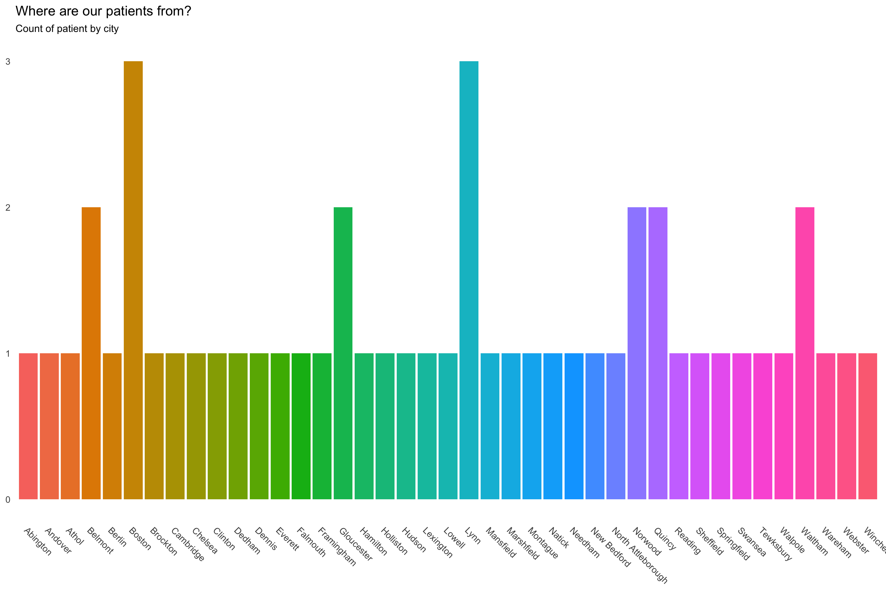
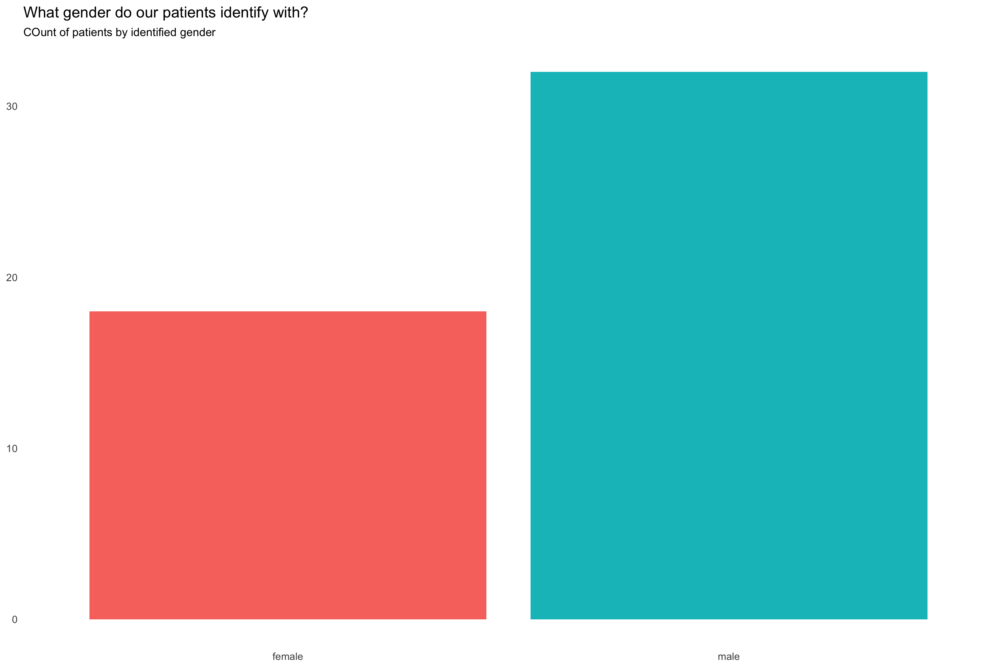
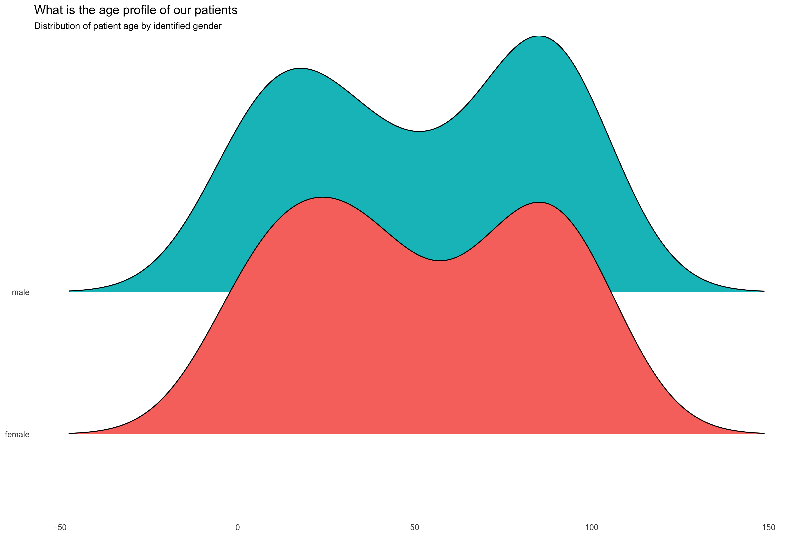

# R on FHIR 

[FHIR](http://hl7.org/fhir) is pronounced 'fire'. It is a healthcare data exchange format
based on a web API that is being implemented by EHR server and other health management 
systems around the world. 

The intent of this project is to make FHIR data available to R for easy analysis

## The R on FHIR package

The project extended the [RonFHIR](https://github.com/furore-fhir/RonFHIR) project 
first developed by Sander Laverman (Furore).

We enhanced the API, and tested the functionality against the server on 
[http://test.fhir.org](http://test.fhir.org)

[Pull Request]https://github.com/furore-fhir/RonFHIR/pull/1()

## Code Fragment

```
library(RonFHIR)

# connect to the server
client <- fhirClient$new("http://test.fhir.org/r3")

# just get a random patient, and print the identifier informaation
a <- client$read(location = "Patient/example", summaryType = "true")
a$identifier

# count Patients on the server with gender = male
b <- client$search("Patient", "gender=male", summaryType="count")
b$total

# now, graphql on a resource
c <- client$qraphQL(location = "Patient/example", query = "{id name{given,family}}")
print(c)

# and a graphQL based search
d <- client$qraphQL(location = NULL, query = "{PatientList(name:\"pet\"){name @first @flatten{family,given @first}}}")
print(d)

```

The output from running this:

```
a$identifier: 

[[1]]
    use                          coding             system     value      start         display
1 usual http://hl7.org/fhir/v2/0203, MR urn:oid:2.15.288.1 622883245 2001-05-06 Acme Healthcare

b$total:
[1] 1009

c:
  data.id             data.name
1 example Adam, Everyman, Jones

d <- client$qraphQL(location = NULL, query = "{PatientList(name:\"pet\"){name @first @flatten{family,given @first}}}")
d:
  PatientList
1 Chalmers, Chalmers...., Peter, Rose...

```

## Graph Examples

Some graphs generated from data accessed by the library, based on the patient list:

`patient_list <- get_patients("http://test.fhir.org/r3")`

### Where are our patients from?


### What gender do our patients identify as?


### How old are our patients?


## Re-organizing the data

FHIR Resources are often quite nested- real like messy operational data.
A straight import like the example above generates deeply nested data frames
that need might need quite a bit of work the reshape them to a useful 
form for data. But each analyses will need a different reshaping. For 
example, in FHIR, patients have multiple names (the name they use, 
their legal name, their maiden name, etc). But most analysis doesn't
care about that- just use the current name. Unless, that is, the 
analysis is about the name types...

Classicly, this process is called ETL (Extract, Transform, Load). Rather than
leaving this data cleansing functionality to R, we extended graphQL, which
is used in FHIR, to provide additional functionality to R consumers.

Specifically, we added 4 directives to the FHIR profile on graphQL:
* @flatten
* @first
* @singleton
* @slice

These directives are documented in the [FHIR documentation](http://build.fhir.org/graphql.html) and 
can be used to flatten the data before presenting it in FHIR. This is better because 
* it's more efficient to limit and reframe the data before transmission
* doing the reformatting in graphQL means that it can be used outside R as well
* graphql is a language with considerable support and the same technique could be adopted elsewhere too

Note that not all the transformation will be able to be done in graphQL. This is a 90/10 thing.
Additional data cleansing will almost always be needed.


